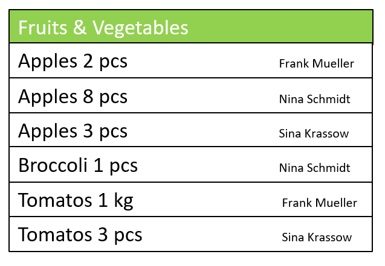

# One for All - Shopping List


Dear Developer, Manager and/or Grocery List Friend,

The Corona crisis confronts us all with new challenges. Elderly people should no longer go outside, suspicious cases must stay at home and we should not meet our friends. Nevertheless, we have to supply ourselves with food, medicine and hygiene articles.

To make shopping as efficient and corona compatible as possible the best is, if one person does the shopping for several households at once - and we should provide a good grocery list app for the person.

**To do so, it would be great if we could extend this simple shopping list app with the following featurs!**

* Summarizes the grocery lists of the several households in one ​Summary-List
* The Summary-List lists the name of the beggars behind the product he wishes
* Still keeps the ​Single-Lists​ of every household so that the Summary-List can be split again during or after the shopping tour
* Categorizes the products so that the shopping tour and the walk through the
supermarket can be planned well

Summary-List example: 



* Enables the export and import of a list in a standardized format in order to send a list (e.g via WhatsApp, Facebook, ... ) to the person who is going to shop 

Datastructure example:
```ruby
Shopping List

{"sID":"2020-03-28-1746-487956235841",
"sName":"my Shopping List",
"uName":"Peter Mayer",
"p_001":{Product},
"p_002":{Product},
"p_005":{Product}
}

Product

{"pName":"Apples",
 "pAmount":2,
 "pUnit":[Unit],
 "pCat":{Category}
}

Units

[kg, g, L, ml, St, Ka]

Category

{"01":"Obst & Gemüse",
 "02":"Milchprodukt",
 "03":"Fleisch & Wurst",
 "04":"Nudeln, Reis & Backwaren",
 "05":"Haltbares",
 "06":"Süßes & Salziges",
 "07":"Sonstiges",
 "08":"Drogerieprodukt",
 "09":"Medizin",
 "10":"Getränke"
} 

```


## Tools

- https://facebook.github.io/react-native/ - React Native
- https://reactnavigation.org/ - React Navigation
- http://redux.js.org/ - Redux
- https://github.com/gaearon/redux-thunk - Redux Thunk
- https://pouchdb.com/ - PouchDB
- https://www.npmjs.com/package/jsdoc - JSDoc

## For React-Native Beginners

* Install node.js, jdk8 and android studio according to https://reactnative.dev/docs/environment-setup
* Take a look at a react-native tutorial e.g. https://www.youtube.com/watch?v=Hf4MJH0jDb4


## Quick Start 

1. Install the React Native CLI:

`npm install --g react-native-cli`

2. Clone this repo:

`git clone https://github.com/jonaswilz/OneForAll-ShoppingList.git`

3. cd into the repo directory:

`cd OneForAll-ShoppingList`

4. Install dependencies:

`npm install`

### Run on iOS Emulator:

1. In a terminal cd into the repo directory and run the following command:

`react-native run-ios`

If you are having problems please see the troubleshooting section below.

### Run on Android Emulator

1. Create and start an AVD
2. In a terminal cd into the repo directory and run the following command:

`react-native run-android`

If you are having problems please see the troubleshooting section below.

## Troubleshooting

1. If you encounter issues running the react-native CLI you may need to make a few scripts executable. You can do this on Mac/Linux by running the following commands:

```
chmod +x /usr/local/lib/node_modules/react-native-cli/index.js
chmod +x node_modules/react-native/local-cli/*.sh
chmod +x node_modules/react-native/scripts/*.sh
chmod +x node_modules/react-native/scripts/*.command
```

## Legal
The application is based on &copy; 2020 https://github.com/ibm-watson-data-lab/shopping-list-react-native-pouchdb.git this repo is licensed under Apache 2.0 https://www.apache.org/licenses/LICENSE-2.0.html
